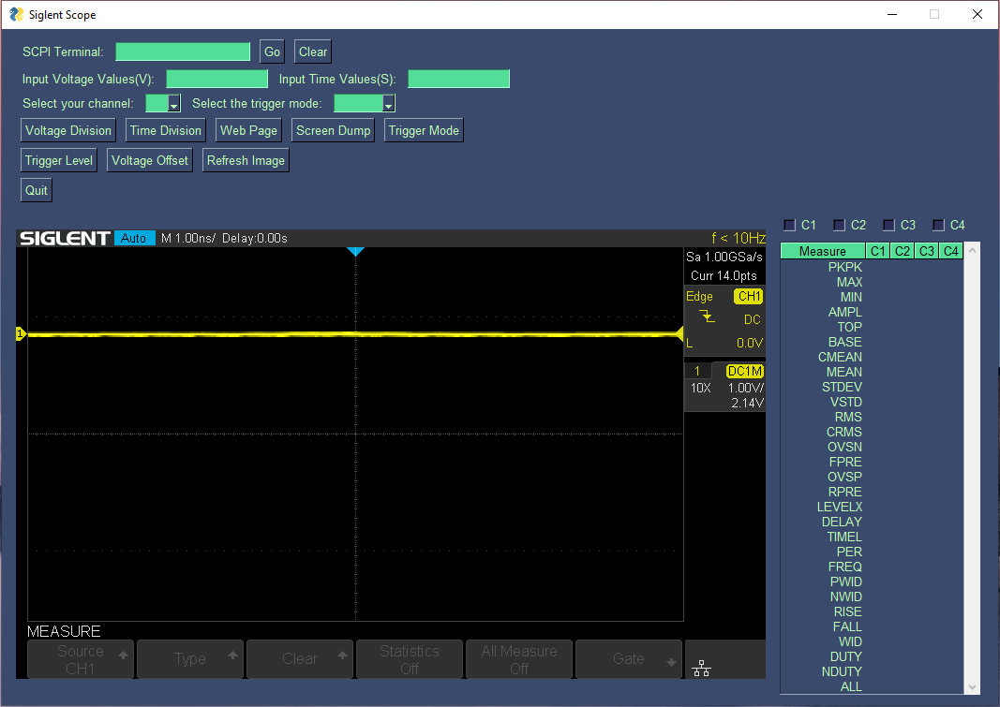

# LabAutomation
This is a program to automate simple tasks on the Siglent SDS 1104XE scope.

- I need to make it so the table actually shows measurement values
- The GUI layout needs some formatting

 **Goals:**

- Plot incoming data in real time and save for later  
- Have presets for certain tasks eg, battery testing.. etc...  
- Add more setup features like setting date and time for data logging etc..  
- Add classes to represent the instrument and future ideas  
- Add a GUI to help with ease of use  
